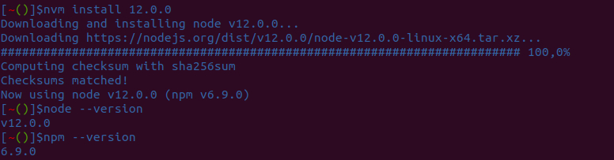

# Práctica 1 - Configuración de máquina virtual en el IaaS
* Universidad de La Laguna
* Eduardo Da Silva Yanes 

## 1. Introduccion
En esta primera práctica de la asignatura de Desarrollo de Sistemas Informáticos debemos configurar nuestra máquina virtual alojada en el IaaS con la que haremos las prácticas. Configuraremos tanto en entorno de la máquina, instalando y configurando git y Node.js y la conexión ssh.
### Objetivos
1. Configurar nuestra máquina virtual del IaaS
2. Configurar nuestra conexión SSH con la máquina del IaaS
3. Instalar y configurar la conexión con Github
4. Instalar nvm (gestor de versiones de Node.js) y Node.js

## 2. Requisitos previos
Para poder realizar esta primera práctica (y todas las que continuan) necesitamos conectarnos a la web del [IaaS](iaas.ull.es). Para ello es necesario utilizar una VPN para poder acceder. Si al acceder al sitio web nos sale un error de "No se puede acceder al sitio" o similar, probablemente no estemos conectados a la VPN. Si no sabemos como hacerlo podemos seguir la guía para [Configurar VPN ULL](https://www.ull.es/servicios/stic/2020/12/01/servicio-de-vpn-de-la-ull/).
También será necesario tener una cuenta de Github ya que será donde volcaremos las tareas que hagamos en un futuro.

## 3. Desarrollo de la práctica

### 3.1 Conectandose por primera vez al IaaS
Lo primero que haremos será conectarnos a la página web del [IaaS](iaas.ull.es). Recordemos que es necesario tener configurada la VPN para establecer conexión tanto con la web como con nuestra máquina. En caso de no haberlo hecho revise el apartado de **Requisitos previos**.
Una vez entramos en la página, introducimos nuestras credenciales institucionales y se nos mostrará una intefaz con las máquinas que hemos creado o tenemos disponibles. Seleccionamos la que pone **DSI** y le damos a ejecutar. Cuando esté lista se nos agregará una máquina con un número de sufijo.
Accedemos a ella y veremos una pantalla como la que se muestra a continuación.

Aquí nos tenemos que fijar en la sección **Detalles** en la parte que pone **Direccion IP**. Esa será la dirección de nuestra máquina y la que usaremos para conectarnos.
Abrimos una terminal y nos conectamos por SSH. Introducimos la dirección que tenga nuestra máquina.


En mi caso es:
```bash
...$ ssh usuario@10.6.131.65
```

Es la primera vez que nos conectamos asi que nos aparecerá un mensaje al que debemos responder afirmativamente. Las credenciales están por defecto asi que nuestra contraseña es "usuario". 
Una vez hemos establecido conexión el sistema nos obliga a establecer una contraseña nueva. Ponemos la que queramos. (Primero se nos pide poner la contraseña actual (por defecto) y luego la nueva que queremos poner dos veces.)

*** IMAGEN ***

Lo siguiente que hacemos es personalizar un poco el nombre de la máquina. En lugar de que nos salga "Ubuntu" en el prompt, vamos a hacer que se muestre el nombre de nuestra máquina. En mi caso pondré **iaas-dsi44** ya que mi máquina es la numero 44.
Para hacer este cambio modificamos el fichero _**/etc/hostname**_ y sustituimos el nombre "Ubuntu" por "iaas-dsi44"
```bash
...$ sudo vim /etc/hostname
```
También vamos a cambiar el nombre de host de "Ubuntu" por iaas-dsi44. Para ello modificamos el fichero _**/etc/hosts**_. Simplemente sustituimos el nombre de "Ubuntu" por el de iaas-dsi44.


Como podemos observar parece que no ha habido ningún cambio. Para que las modificaciones que hemos hecho tengan efecto debemos reiniciar el sistema. Pero antes de eso vamos a aprovechar a actualizar y poner todo al día.

```bash
...$ sudo apt update
...$ sudo apt upgrade
```
Una vez finalizados podemos reiniciar
```bash
...$ sudo reboot
```


Ahora vamos a dejar de lado momentaneamente la VM del IaaS para trabajar en nuestro PC local. Es posible que alguna vez nos se nos olvide o dudemos en cual era la ip de nuestra máquina virtual. Para evitar tener que recordarla podemos añadirla al fichero **/etc/hosts**.
```bash
...$ sudo vi /etc/hosts

//Añado debajo del host local de mi máquina la IP de la máquina virtual.
//En mi caso añado la linea:
10.6.131.65   iaas-dsi44
```


Algo muy cómodo sería usar el comando SSH y que se conectara automáticamente sin necesidad de tener que poner la contraseña. Eso es precisamente lo que haremos.
Lo primero es revisar si en algún momento ya hemos generado una clave.
```bash
...$ cat .ssh/id_rsa.pub 
```
Si tenemos un output que empieza por **ssh-rsa** significa que en algún momento ya generamos esa clave y no es necesario hacer otra. Si por el contrario obtenemos un error, debemos generar una clave ssh. En mi caso ya la había generado con anterioridad.


Para generar la clave ejecutamos el siguiente comando: 
```bash
...$ ssh-keygen
```
Es importante que usemos los **parametros por defecto** asi que simplemente daremos **enter / intro** hasta que finalice.
Ahora solo falta pasar esta clave desde nuestra máquina local a la máquina de IaaS. Para ello usamos:
```bash
...$ ssh-copy-id usuario@10.6.131.65
```
Ya tenemos nuestro "token de autentificación" en la máquina virtual y podemos iniciar una conexión SSH sin necesidad de poner la contraseña.

Si queremos llevar un paso más allá nuestra comodidad podemos hacer que ni siquiera tengamos que poner el usuario al iniciar la conexión SSH.
Vamos a editar el fichero **~/.ssh/config**. En caso de que no lo tengamos creado lo debemos crear.
```bash
...$ touch ~/.ssh/config //SOLO EN CASO DE NO TENERLO 
...$ vi ~/.ssh/config

//Debemos añadir lo siguiente 
Host iaas-dsi44
  Hostname iaas-dsi44
  User usuario

...$ cat ~/.ssh/config
//Comprobamos que está todo correcto
```
En el campo *Host* ponemos el nombre por el que llamaremos a esa conexión. En **Hostname** ponemos la IP de la conexión pero como anteriormente, en el fichero /etc/hosts/ habiamos llamado "iaas-dsi44" a la IP podemos poner ese nombre. Ambas opciones son igualmente válidas.


Ahora, cuando querramos hacer una conexión SSH solo debemos ejecutar:
```bash
...$ ssh iaas-dsi44
```

### 3.2 Instalación Git y configuración

Antes de comenzar con Git vamos a generar una clave pública-privada en nuestra VM del IaaS. Lo haremos siguiendo los pasos anteriores pero sin pasar la clavea ninguna máquina más. Una vez generamos la key no hacemos nada más.

Vamos a comprobar que tenemos **git** instalado. En teoría está instalado por defecto en las máquinas de IaaS. Podemos verificarlo escribiendo "git" en la consola y observando cómo se nos despliega una ayuda o utiizando el comando:
```bash
...$ sudo apt install git
```
Aquí nos va a decir si está instalado o no y si tenemos la versión más reciente. En nuestro caso todo está correcto.
Lo siguiente es configurar Git para que el trabajo que hagamos esté identificado con nuestros datos.
Podemos hacer una configuración más amplia y completa pero lo principal que debemos hacer es:
```bash
...$ git config --global user.name "Eduardo Da Silva"
...$ git config --global user.email alu0101104911@ull.edu.es
```
Verificamos que lo hemos puesto correctamente con:
```bash
...$ git config --list
```


Ahora vamos a modificar el prompt de la terminal para que nos muestre en la rama actual en la que nos encontramos del repositorio. Para ello debemos descargarnos el script [git-prompt.sh](https://github.com/git/git/blob/master/contrib/completion/git-prompt.sh) (también podemos simplemente copiar el código del script y pegarlo en un fichero que creemos) en nuestra máquina del IaaS.
Seguimos los siguientes pasos:
```bash
...$ mv git-prompt.sh .git-prompt.sh
...$ vim .bashrc
```
Y añadimos al final del fichero **.bashrc** estas dos líneas:
```
source ~/.git-prompt.sh
PS1='\[\033]0;\u@\h:\w\007\]\[\033[0;34m\][\[\033[0;31m\]\w\[\033[0;32m\]($(git branch 2>/dev/null | sed -n "s/\* \(.*\)/\1/p"))\[\033[0;34m\]]$'
```
Comprobamos que está modificado correctamente y aplicamos los cambios.
```bash
...$ tail .bashrc
//Debemos ver las dos lineas que acabamos de añadir al final, algo tal que así:
...
source ~/.git-prompt.sh
PS1='\[\033]0;\u@\h:\w\007\]\[\033[0;34m\][\[\033[0;31m\]\w\[\033[0;32m\]($(git branch 2>/dev/null | sed -n "s/\* \(.*\)/\1/p"))\[\033[0;34m\]]$'

...$ exec bash -l
```
Ahora ya vemos que el prompt tiene una forma distinta.
Vamos a comprobar que todo funciona correctamente. Es decir, que nos indica en cada momento en que rama del repositorio estamos. 
Antes de clonar un repositorio vamos a añadir la clave SSH que hemos generado a nuestra cuenta de Github. 
Para ello lo primero es copiarla del fichero **id_rsa.pub**.
```bash
...$ cat ~/.ssh/id_rsa.pub
```
Copiamos la salida y abrimos nuestra cuenta de Github. Accedemos a **configuración** y accedemos al apartado de **SSH and GPG keys**. Ahí debemos darle a **"New SSH key"** y pegamos nuestra clave.
Ahora clonemos un repositorio para verificar que todo este correcto.
```bash
...$ git clone git@github.com:ULL-ESIT-INF-DSI-2021/prct01-iaas-vscode.git
```
Si accedemos al repositorio que acabamos de clonar deberiamos ver cómo cambia el prompt.


### 3.2 Instalación Node Version Manager (nvm)
Vamos a instalar nvm.
```bash
$wget -qO- https://raw.githubusercontent.com/nvm-sh/nvm/v0.37.2/install.sh | bash
exec bash -l
nvm --version
```
El resultado del último comando nos debería decir que es la versión **0.37.2**
Ahora vamos a instalar la versión **más reciente** de **Node.js**
```bash
...$ nvm install node

//Comprobamos las versiones 
...$ node --version
...$ npm --version
```


Si en lugar de la más reciente queremos instalar otra versión debemos hacer lo siguiente:
```bash
...$ nvm install 12.0.0

//Comprobamos las versiones 
...$ node --version
...$ npm --version
```


En nuestro caso hemos instalado la versión 12.0.0 pero podemos instalar cualquier otra versión disponible.
Finalmente, si queremos cambiar de versión gracias al nvm lo que debemos hacer es:
1. Listar las versiones que tenemos instaladas
```bash
nvm list
```
2. Seleccionar de la lista la que queremos usar actualmente. En nuestro caso pondremos la v15.8.0 
```bash
nvm use v15.8.0 
```
3. Comprobar que se ha seleccionado correctamente
```bash
...$ nvm use v15.8.0 
...$ node --version
...$ npm --version
```


## 4. Conclusión
De manera general este tipo de prácticas son muy **útiles** ya que nos permite establecer un **entorno de trabajo estandar para todos los alumnos** de tal manera que todos podamos trabajar en las mismas condiciones y evitar errores o contratiempos. Además nos sirve como punto de partida para saber qué necesitamos para la asignatura y nos da pie a trabajar, en caso de que no lo hayamos hecho antes, con VPN, git, Github, conexiónes remotas, etc.

Así mismo, como **futuros ingenieros informáticos**, aprender a tener un entorno de trabajo **cómodo** y **óptimo** para desarrollar nuestras labor es álgo fundamental.
## 5. Recursos y Webgrafía
* **[Guión Práctica 1 DSI](https://ull-esit-inf-dsi-2021.github.io/prct01-iaas/)**: Guión de la asignatura donde detalla el desarrollo de la práctica 1.
* **[Mastering Markdown](https://guides.github.com/features/mastering-markdown/)**: Guía de Github sobre Markdown.
* **[VincentTam _config.yml on Github](https://github.com/daattali/beautiful-jekyll/blob/master/_config.yml)**: Archivo _config.yml con explicaciones de los parámetros para entender mejor que contiene el fichero.
* **[Servicio VPN ULL](https://www.ull.es/servicios/stic/2020/12/01/servicio-de-vpn-de-la-ull/)**: Web de la Universidad de La Laguna donde se explica como acceder a la VPN de la institución.
